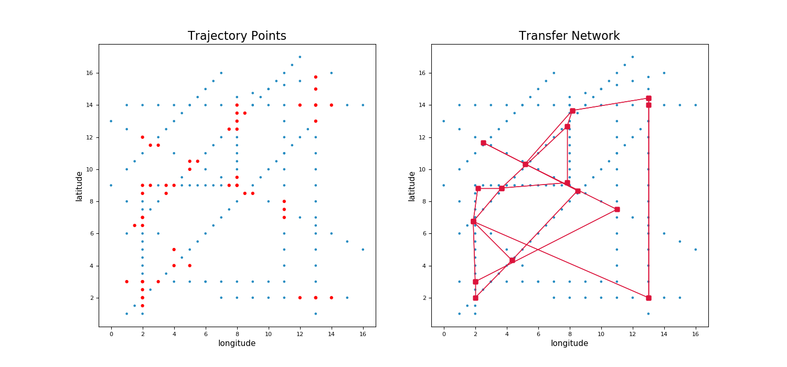
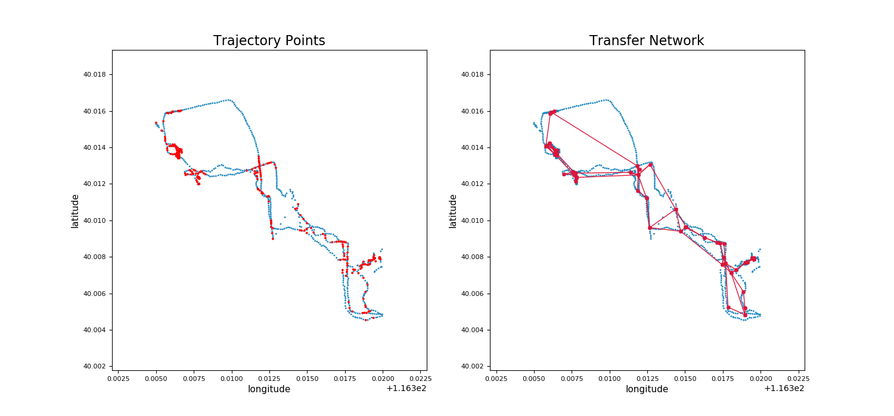

# Discovering Popular Routes from Trajectories
Implementation of an algorithm for discovering popular routes from trajectories based on the paper [published by IEEE](https://ieeexplore.ieee.org/document/5767890)

> **Abstract**
*The booming industry of location-based services has accumulated a huge collection of users' location trajectories of driving, cycling, hiking, etc. In this work, we investigate the problem of discovering the Most Popular Route (MPR) between two locations by observing the traveling behaviors of many previous users. This new query is beneficial to travelers who are asking directions or planning a trip in an unfamiliar city/area, as historical traveling experiences can reveal how people usually choose routes between locations. To achieve this goal, we firstly develop a Coherence Expanding algorithm to retrieve a transfer network from raw trajectories, for indicating all the possible movements between locations. After that, the Absorbing Markov Chain model is applied to derive a reasonable transfer probability for each transfer node in the network, which is subsequently used as the popularity indicator in the search phase. Finally, we propose a Maximum Probability Product algorithm to discover the MPR from a transfer network based on the popularity indicators in a breadth-first manner, and we illustrate the results and performance of the algorithm by extensive experiments.*

## Data Preparation
The dataset we used in our experiments is downloaded from [here](https://www.microsoft.com/en-us/download/details.aspx?id=52367)

<!-- The dataset path and some other variables have to set in advance -->
The script takes *.plt files as input. The dataset path and some other variables have to be set with the following format :

Starting at line 24 in ```config.py```:

```
DATASET_ROOT_DIR = '../../test2/Data'   # The data set root directory
DATASET_SCALE    = 3                    # How many users' trajectory data are choosed
TRAJACTORY_SCALE = 4                    # How many trajectories are choosed per user
RANGE = {                               # To pick trajectory points within the range
    'status': True,
    'longitude_upper_bound': 116.32,
    'longitude_lower_bound': 116.304,
    'latitude_upper_bound': 40.018,
    'latitude_lower_bound': 40.004,
}
```

## Mining Transfer Network
Coherence expanding algorithms are used to construct the trasfer network from a set of raw trajectory points.

### Step 1
Set parameters for coherence expanding algorithm. These variables have to be carefully adjusted according to different dataset. 

Starting at line 35 in ```config.py```:
```
GROUP_SIZE_THRESHOLD    = 3         # group size threshold φ
COHERENCE_THRESHOLD     = 0.99      # coherence threshold τ
SCALING_FACTOR          = 15e-4     # scaling factor δ
TURNING_ALPHA           = 5         # tuning parameter α
TURNING_BETA            = 2         # tuning parameter β
```

### Step 2
Initialize the program by running

`` python adjust_params.py ``

Analysis graph and reports are generated to help adjust the parameters


**Figure 1** *experiment on simulated dataset with 192 points, 16 clusters are found*


**Figure 2** *experiment on real dataset with 1154 points, 60 clusters are found*

## Deriving Transfer Probability